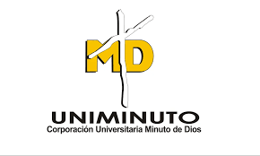

# FinanciacionFamiliar - Programación Web

Hecho por Carol Ospina, Santiago Fonseca, Paula Gomez

Presentación de Proyecto Entrega Final

Universidad minuto de Dios

https://github.com/santiagofonseca13/FinanciacionFamiliar

Hecho por: 

Santiago Fonseca - Carol Ospina - Paula Gomez

Introducción

#La familia quiere organizar unas vacaciones para descansar y cambiar de ambiente, pero se enfrenta a que no tiene una organizacionde sus gastos Vs sus ingresos y deseaconocer que dinero queda al final de cadames; Su trabajo y el de su equipo es desarrollar una aplicación WEB para gerenciar el hogar.

¡Gracias por tu atención!